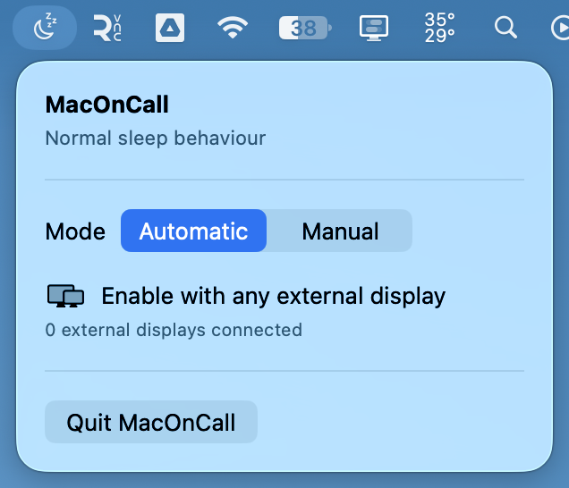
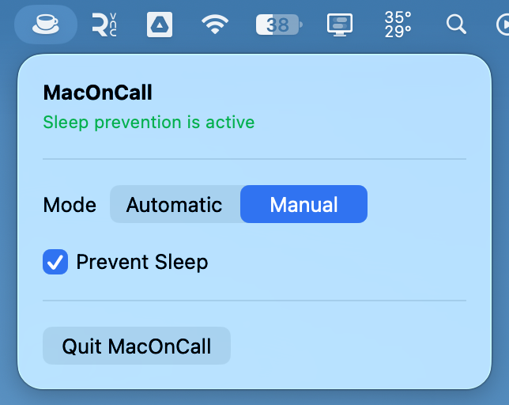

# MacOnCall

MacOnCall is a menu-bar-only macOS utility for keeping a Mac awake while you are on call. It uses per-process macOS power assertions plus a clamshell override to prevent idle system and display sleep while the app is running.

<table>
  <tr>
    <td></td>
    <td></td>
  </tr>
</table>

## Status

> FYI: I don't know Swift and Mac development, but I would think I kinda know how to code :)
>
> PRs to improve are definitely welcome!

This app was vibe coded and is currently untested in real-world use. In particular, power-source transitions, display hot-plugging, authorization behavior, sleep/wake behavior, and different macOS hardware configurations still need to be tested. Use it at your own risk and verify the live setting yourself.

## Requirements

- macOS 14 or later
- Xcode, to build the project

## Run from Xcode

1. Open `MacOnCall.xcodeproj` in Xcode.
2. Select the **MacOnCall** scheme and **My Mac** as the run destination.
3. Build and run.

The app appears in the menu bar. It does not show a normal Dock window.

## Modes

### Automatic

Automatic mode is the default. Sleep prevention is enabled whenever the number of connected external displays is **1 or more** (`externalDisplayCount >= 1`). It is restored when the external display count returns to zero.

### Manual

In Manual mode, choose a 1, 2, 3, 5, or 8-hour session, enter a custom number of hours, or enable **Indefinite**. Timed sessions show the remaining time and turn sleep prevention off automatically when they expire.

## Power-source changes

The power assertions belong to the running MacOnCall process. MacOnCall listens for power-source, wake, display, and clamshell state changes and restores the active session when macOS clears its runtime state.

## Safety and persistence

- The selected mode, indefinite setting, and active timed-session deadline are saved between launches.
- The assertion is released when sleep prevention is disabled or when MacOnCall quits.
- No administrator password is required.
- Closing the lid turns off the built-in display as required by clamshell mode; MacOnCall cannot keep that panel lit. An attached external display should remain awake while prevention is active.
- Selecting Sleep manually or other forced-sleep events may still sleep the Mac.

> [!WARNING]
> Clamshell support uses an undocumented IOKit power-management selector because macOS does not provide a public API for overriding lid-close sleep. MacOnCall reapplies it in response to system events, but its behavior may vary across macOS versions and hardware.

> [!WARNING]
> This app was vibe coded and remains untested in real-world use. Do not rely on it for unattended work until you have verified its behavior on your own Mac.

## Check the live assertion

`SleepDisabled` is a global `pmset` setting and is not the indicator for MacOnCall's assertion. To check whether MacOnCall currently holds its assertion, run:

```sh
pmset -g assertions | grep -i -C 2 maconcall
```

You should see `PreventUserIdleSystemSleep` and `PreventUserIdleDisplaySleep` assertions owned by MacOnCall while prevention is active. `pmset -g | grep -i sleepdisabled` may still report `SleepDisabled 0`, which is expected with this implementation.

## Build a release app

Install `create-dmg` once if you want to package the app:

```sh
brew install create-dmg
```

Build a release app into the repository's `build` directory:

```sh
./scripts/build.sh
```

Then create the DMG:

```sh
./scripts/make-dmg.sh
```

Copy the resulting app to `/Applications`, replacing any older version, before testing the changes.

## Automated releases

Every push to `main`—including a merged pull request—runs the GitHub Actions workflow at `.github/workflows/publish-release.yml`. It builds an unsigned Release app, creates `MacOnCall.dmg`, and publishes a new GitHub release with the DMG attached.

The workflow requires the repository's default `GITHUB_TOKEN` to have permission to write repository contents. The generated releases are build artifacts, not signed or notarized production releases.
